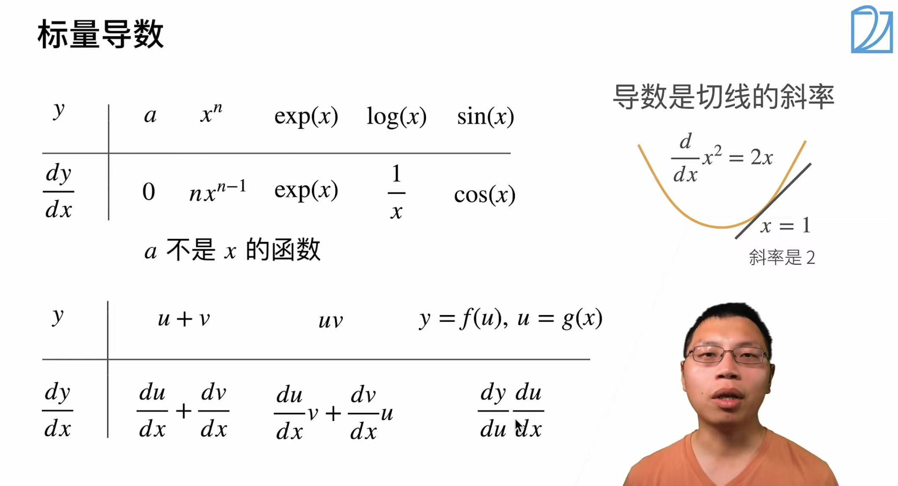
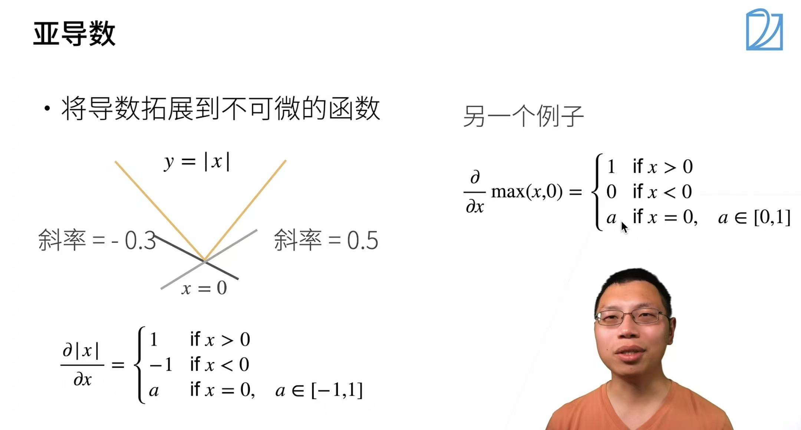
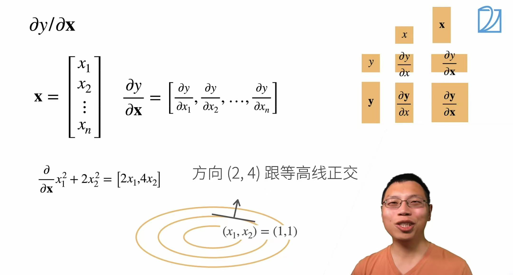
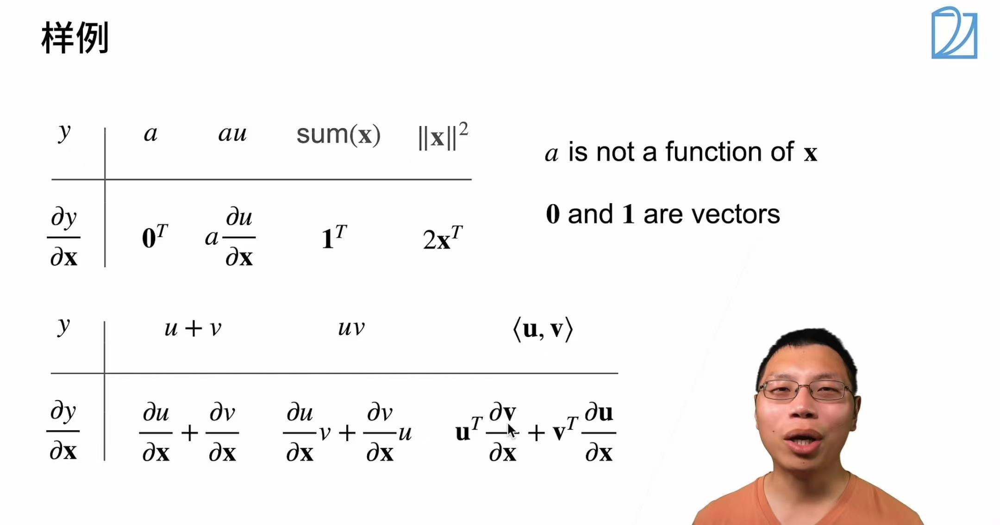
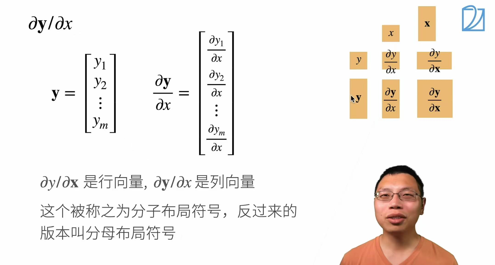
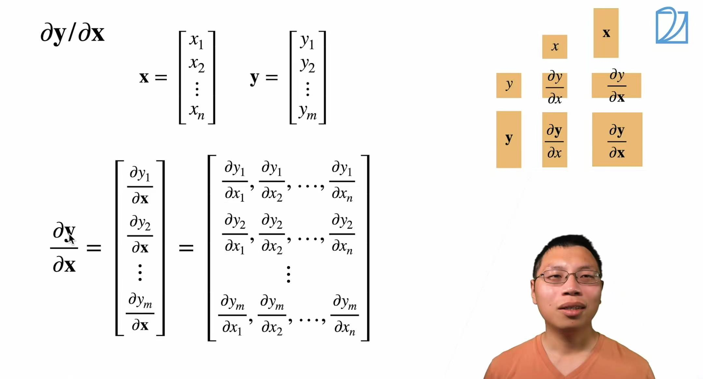
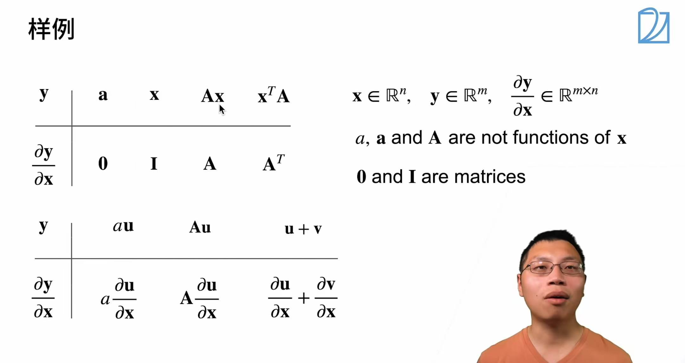
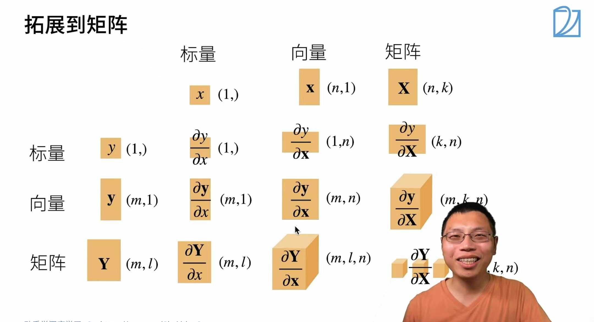

* 标量导数

* 亚导数

* 一个标量函数 $y = f(x_1,x_2,\dots,x_n)$对向量变量$x$的偏导数
* 梯度向量（gradient）$\frac{\partial y}{\partial \boldsymbol{x}}$,这是函数$y$对每个变量$x_i$的偏导数组成的行向量，梯度指向函数值增加最快的方向

* 向量对向量求导

* 标量对标量求导，结果还是标量，$\frac{dx^2}{dx} = 2x$
* 标量对向量求导，$\frac{\partial y}{\partial \boldsymbol{x}}$结果是行向量，维度(1,n)（$y$对$\boldsymbol{x}$每个元素求偏导数，排成一行
* 标量对矩阵求导，$\frac{\partial y}{\partial \boldsymbol{X}}$结果是矩阵，维度(k,n)（$y$对$\boldsymbol{X}$每个元素求偏导数，按原矩阵行列转置排列
* 向量对标量求导，$\frac{\partial \boldsymbol{y}}{\partial x}$结果是列向量，维度(m,1)（$\boldsymbol{y}$每个元素对标量x求导，排成一列
* 向量对向量求导，$\frac{\partial \boldsymbol{y}}{\partial \boldsymbol{x}}$结果是矩阵，维度(m,n)（$\boldsymbol{y}$每个元素对$\boldsymbol{x}$每个元素求导，形成m行n列的雅可比矩阵
* 向量对矩阵求导，$\frac{\partial \boldsymbol{y}}{\partial \boldsymbol{X}}$结果是三维张量，维度(m,k,n)
* 矩阵对标量求导，$\frac{d\boldsymbol{Y}}{dx}$结果是矩阵，维度(m,l)
* 矩阵对向量求导，$\frac{\partial \boldsymbol{Y}}{\partial \boldsymbol{x}}$结果是三维张量，维度(m,l,n)（$\boldsymbol{Y}$每个元素对$\boldsymbol{x}$求偏导，原m×l矩阵拓展为每个元素对应n维）
* 矩阵对矩阵求导，$\frac{\partial \boldsymbol{Y}}{\partial \boldsymbol{X}}$结果是四维张量，维度(m,l,k,n)

