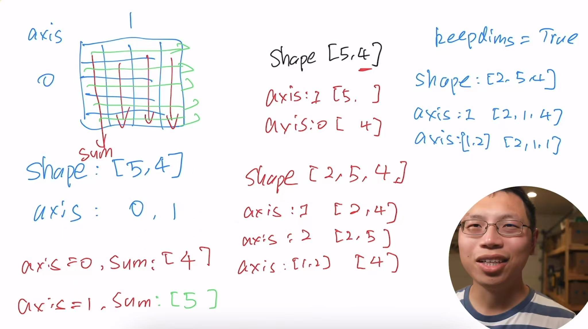

#### 标量
```
x = torch.tensor(3.0)
y = torch.tensor(2.0)
x + y, x * y, x / y, x**y

(tensor(5.), tensor(6.), tensor(1.5000), tensor(9.))
```
#### 向量
你可以将向量视为标量值组成的列表，可以通过张量的索引来访问任一元素
```
x = torch.arange(3)
x

tensor([0, 1, 2])
```
```
x[2]

tensor(2)
```
```
len(x)

3
```
```
x.shape

torch.Size([3])
```
```
A = torch.arange(6).reshape(3, 2)
A

tensor([[0, 1],
        [2, 3],
        [4, 5]])
```
矩阵的转置，对称矩阵等于其转置
```
A.T

tensor([[0, 2, 4],
        [1, 3, 5]])
```
就像向量是标量的推广，矩阵是向量的推广一样，我们也可以构建具有更多轴的数据结构
```
a = 2
X = torch.arange(24).reshape(2, 3, 4)
a + X, (a * X).shape

(tensor([[[ 2,  3,  4,  5],
          [ 6,  7,  8,  9],
          [10, 11, 12, 13]],
 
         [[14, 15, 16, 17],
          [18, 19, 20, 21],
          [22, 23, 24, 25]]]),
 torch.Size([2, 3, 4]))
```
给定具有相同形状的任何两个张量，任何按元素二元运算的结果都是具有相同形状的张量
```
A = torch.arange(6, dtype=torch.float32).reshape(2, 3)
B = A.clone()
A, A + B

(tensor([[0., 1., 2.],
         [3., 4., 5.]]),
 tensor([[ 0.,  2.,  4.],
         [ 6.,  8., 10.]]))
```
两个矩阵的按元素乘法称为哈达玛积(Hadamard product)
```
A*B
tensor([[ 0.,  1.,  4.],
        [ 9., 16., 25.]])
```
计算其元素的和
```
x = torch.arange(3, dtype=torch.float32)
x, x.sum()

(tensor([0., 1., 2.]), tensor(3.))
```
指定求和汇总张量的轴
```
A.shape, A.sum(axis=0).shape,A.sum(axis=0)

(torch.Size([2, 3]), torch.Size([3]), tensor([3., 5., 7.]))
A.shape, A.sum(axis=1).shape
```
```
A.shape, A.sum(axis=1).shape,A.sum(axis=1)

(torch.Size([2, 3]), torch.Size([2]), tensor([ 3., 12.]))
```
```
 A.sum(axis=[0,1]),A.sum(axis=[0, 1]) == A.sum()

 (tensor(15.), tensor(True))
```
一个与求和相关的量是平均值
```
A.mean(), A.sum() / A.numel()

(tensor(2.5000), tensor(2.5000))
```
```
A.mean(axis=0), A.sum(axis=0) / A.shape[0]

(tensor([1.5000, 2.5000, 3.5000]), tensor([1.5000, 2.5000, 3.5000]))
```
```
A.mean(axis=1), A.sum(axis=1) / A.shape[1]

(tensor([1., 4.]), tensor([1., 4.]))
```
计算总和或均值时保持轴数不变（一个三维的矩阵，按一个维度求和，变成一个二维的矩阵；一个二维的矩阵，按一个维度求和，变成一个一维的向量，但是我们不想丢掉这个维度）
```
sum_A = A.sum(axis=1, keepdims=True)
sum_A, sum_A.shape,A.sum(axis=1)

(tensor([[ 3.],
         [12.]]),
 torch.Size([2, 1]),
 tensor([ 3., 12.]))
```
通过广播将`A`除以`sum_A`（维度必须是一样的）
```
A / sum_A

tensor([[0.0000, 0.3333, 0.6667],
        [0.2500, 0.3333, 0.4167]])
```
某个轴计算`A`元素的累积总和
```
A.cumsum(axis=0),A.cumsum(axis=1)

(tensor([[0., 1., 2.],
         [3., 5., 7.]]),
 tensor([[ 0.,  1.,  3.],
         [ 3.,  7., 12.]]))
```
点积是相同位置的按元素乘积的和
`torch.dot`只能用于一维向量
```
y = torch.ones(3, dtype = torch.float32)
x, y, torch.dot(x, y)

(tensor([0., 1., 2.]), tensor([1., 1., 1.]), tensor(3.))
```
我们可以通过执行按元素乘法，然后进行求和来表示两个向量的点积
```
torch.sum(x * y)

tensor(3.)
```
矩阵向量积$\boldsymbol{A}$$\boldsymbol{x}$是一个长度为$\boldsymbol{m}$的列向量，其$\boldsymbol{i}^{th}$元素是点积$\boldsymbol{a}_i\top\boldsymbol{x}$
```
A.shape, x.shape, torch.mv(A, x), A@x 

(torch.Size([2, 3]), torch.Size([3]), tensor([ 5., 14.]), tensor([ 5., 14.]))
```
我们可以将矩阵-矩阵乘法$\boldsymbol{AB}$看作是简单地执行$\boldsymbol{m}$次矩阵向量积，并将结果拼接在一起，形成一个$\boldsymbol{n×m}$矩阵
```
B = torch.ones(3,3)
torch.mm(A,B)

tensor([[ 3.,  3.,  3.],
        [12., 12., 12.]])
```
$\boldsymbol{L}_2$范数是向量元素平方和的平方根：$$\|\mathbf{x}\|_2 = \sqrt{\sum_{i=1}^n x_i^2}$$
```
u = torch.tensor([3.0, -4.0])
torch.norm(u)

tensor(5.)
```
$\boldsymbol{L}_1$范数是向量元素平方和的平方根：$$\|\mathbf{x}\|_1 = \sum_{i=1}^n |x_i|$$
```
torch.abs(u).sum()

tensor(7.)
```
矩阵的弗罗贝尼乌斯范数（Frobenius norm）是矩阵元素的平方和的平方根：$$\|\mathbf{x}\|_F = \sqrt{\sum_{i=1}^n\sum_{j=1}^n x_{ij}^2}$$
```
torch.norm(torch.ones((4, 9)))

tensor(6.)
```



